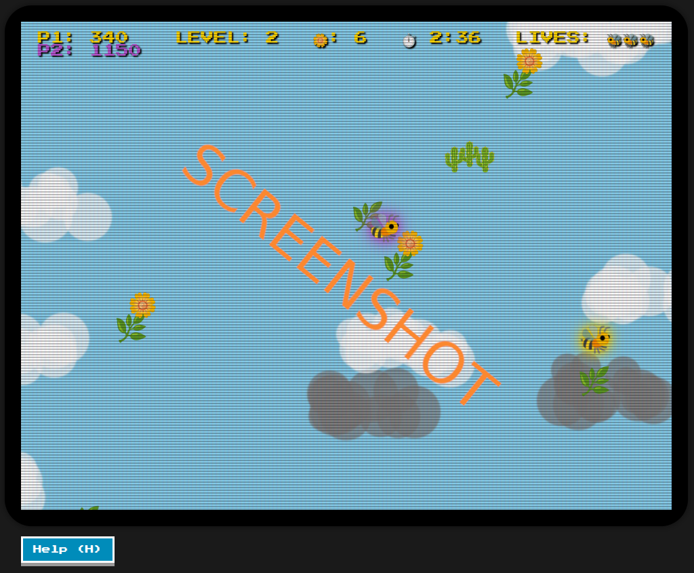

# js_bumbleracing

## Play it now: https://pemmyz.github.io/js_bumbleracing/

# 🐝🌼🐝 Bee Flower Bee (Co-op)

A retro-styled browser game inspired by arcade classics and the bee arcade minigame from **GTA:SA**.  
Collect all the 🌼 flowers before the timer runs out, bounce off leaves 🌿, and avoid thorny 🌵 obstacles!  

Built with **HTML5, CSS3, and vanilla JavaScript** — no external libraries required.  

---

## 🎮 Gameplay

- **Controls**
  - **Player 1:**  
    - ⬅️➡️ `A/D` → Move left/right  
    - ⬆️ `W` or `Space` → Thrust upwards  
  - **Player 2 (join anytime with ⬆️ Arrow):**  
    - ⬅️➡️ `Arrow Keys` → Move left/right  
    - ⬆️ `Arrow Up` → Thrust upwards  

- **Objectives**
  - Collect all 🌼 flowers before time runs out
  - Avoid thorny 🌵 clusters
  - Bounce off 🌿 platforms to stay airborne  

- **Progression**
  - Each level increases difficulty (more platforms, flowers, and thorns)
  - Extra life awarded every 3 levels
  - Score bonus for leftover time at the end of a level  

- **Co-op Mode**
  - Drop-in/out 2-player cooperative play
  - Both players share the same pool of lives
  - Camera adjusts dynamically to keep both players visible  

---

## 🕹️ Features

- Retro CRT screen effect with scanlines and glow  
- Pixel-perfect emoji-based graphics  
- **Dynamic cloud system** with drifting ☁️ and ⚡ thunderclouds  
- Physics: gravity, thrust, and bounce mechanics  
- Randomized level generation for endless replayability  
- **HUD with two-player support**:  
  - Score (P1 + optional P2)  
  - Level  
  - Flowers left  
  - Timer  
  - Shared Lives (🐝 icons)  
- **Message & overlay screens**:  
  - Start / Game Over screen  
  - Level transition messages  
  - Help screen with instructions  

---

## 🛠️ Developer Mode

Enable **Developer Mode** for debugging:

- Toggle with **`J` key**  
- Shows collision hitboxes  
- Displays a **DEV MODE** indicator on HUD  
- Extra dev hotkey:  
  - **`N` key** → Skip to next level  

---

## ❓ Help & Controls Overlay

- In-game help screen (`H` key or external **Help (H)** button)  
- Explains objectives, controls, dangers, lives, and hotkeys  
- Player 2 can join anytime by pressing ⬆️ Arrow  

---

## 📸 Screenshots

*(Add screenshots here once you have them!)*  

---

## 💡 Future Ideas

- 🎵 Add retro sound effects & background music  
- 🌩️ Thunder cloud hazards (lightning strikes?)  
- 🌍 Online leaderboard for high scores  
- 📱 Mobile touch controls  
- 🐸 Secret "AMIGAAA!" frog mode  

---

## 📜 License

MIT License  
Free to play, modify, and share.
